# Go-Tennis

## Goal For This Project

Go-Tennis is a place that helps facilitate a love of tennis for those in the community. This lesson first space, creates an environment where people can become better tennis players and cater to their needs to do so. First and foremost it is about teaching proper skills in tennis with lesson for all skill levels through a pay per lesson model. Also to facilitate students progressing into being better palyers, there is access to tennis merchandise through the shop feature.

## Table of Contents


## UX

### User Stories
#### Viewing and Navigation
- As a user, I want to easily navigate the site in an intuitive way.
- As a user, I want to view list of products.
- As a user, I want to quickly identify product categories. 
#### Registration and User Accounts
- As a user, I want a clear & easy way to register and join.
- As a user, I want to easily log in with my username and password.
- As a user, I want to see my profile and what I've bought or scheduled.
- As a user, I want to easily and quickly log out.
- As a user, I want to recover my password in case i forget it.
- As a user, I want to receive email confirmation after registering.
- As a user, I want to have a personlised user profile.  
#### Sorting and Searching
- As a user, I want to sort the list of available products.
- As a user, I want to sort a specific category of product.
- As a user, I want to search for a product by name.
#### Information
- As a user, I want to find out more about Go-Tennis on social media. 
- As a user, I want to find where the lessons are located.
- As a user, I want to be prepared for lessons with tennis equipment. 
- As a user, I want to be able to know about the coaches I might hire.
- As a user, I want to know what other people think of the coaches.
- As a user, I want to see what the lessons entail.
- As a user, I want to know what the pricing of the lessons are.
- As a user, I want to know what the lesson schedule looks like. 
#### Purchasing and Checkout
- As a user, I want to easily select size and quantity of a product when purchasing it. 
- As a user, I want to be able to find what tennis equipment I am looking for easily. 
- As a user, I want to be able to see individual product details, price, and images.
- As a user, I want to be able to buy equipment easily and clearly. 
- As a user, I want to be able to book a lesson.
- As a user, I want to view items in my bag to be purchased.
- As a user, I want to adjust the quantity of individual items in my bag.
- As a user, I want to feel my personal and payment information is safe and secure.
- As a user, I want to view order confirmation after checkout.
- As a user, I want to receive email confirmation after checking out. 

- As the site owner, I want users to be able to use my site easily.
- As the site owner, I want to be able to promote my shop. 
- As the site owner, I want to easily add products, lessons, and coaches easily.
- As the site owner, I want to easily change products, lesson, and coaches easily.
- As the site owner, I want to delete products, lessons, and coaches easily.
- As the site owner, generate more business through webshop and single purchases.

### Design Choices

- The site is based around tennis and the particular logo for the site. 
- The site itself needed to be easy to navigate, provide information users would find beneficial, and display said information in a way that is visually appealing. 
- The overall design choice created a space that was malleable and gave space for an ecommerce functionality.   
- [Balsamiq](https://balsamiq.com/) was used to create the wireframes and organise how the site flowed. 
- Balsamiq also helped visualise how the different pages would look on different screen sizes. 
- Once the project was built following the planning stages, there were ways that the design changed while building the site. Because my background isn't in design, it is hard to come up with something that appeals visually from a blank slate. The design process was an evolving process that required tweeks and changes to improve Go-Tennis and create something that looked appeasing. 

### Fonts

- The goal was to have a crisp and modern feel with a bit of punch. 
- [Google Fonts](https://fonts.google.com/) was used to find a font that had the right feel for Go-Tennis. The font chosen was 'Lara'. 'Lara' is a well balanced contemporary serif which is optimised for screen performance. 

### Icons

- Go-Tennis takes advantage of iconography by utilizing icons from [Font Awesome](www.fontawesome.com).
- The top three buttons on the navbar use icons to give a clear visual cue to solidify what the buttons do (search, account, and shopping bag). 
- The icons made the content more concise and didn't distract from the information.
- An important icon used, is the hamburger icon that will make navigation more simple on mobile devices.
- Social media icons are also used to give clear indication of how to follow Go-Tennis on social media.
- The logo and favicon was chosen for it's simple representation of tennis. 

### Colours

- The colour theme included six main colours that complimented one another.
- The colours were chosen because of their contrast and they way they complimented the logo.
- The colours felt appropriate because of the way they went with the logo and the main photo on the homepage.  

<div align="center">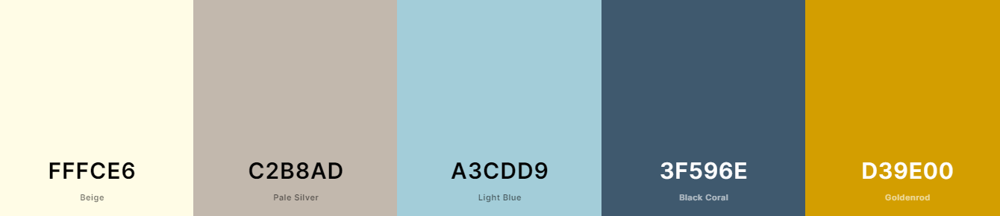</div>

- #fffce6 Beige
    - A soft beige colour to be used instead of white for a nice neutral light colour
- #c2b8ad Pale Silver
    - Another neutral colour to be used for things that shouldn't garner too much attention like back and cancel buttons. 
- #a3cdd9 Light Blue
    - The main colour of Go-Tennis. This shade of light blue is the dominant colour and can be seen all around the site. 
- #3f596e Black Coral
    - A darker blue used as a bit of contrast to the main blue of the site. Mostly used around the light blue where using more light blue would be overpowering. 
- #d39e00 Goldenrod
    - A pop of colour for things that are meant to stand out like the stars on the comment page. 

### Wireframes

#### Desktop Wireframes
<details><summary>Homepage</summary>
<p>

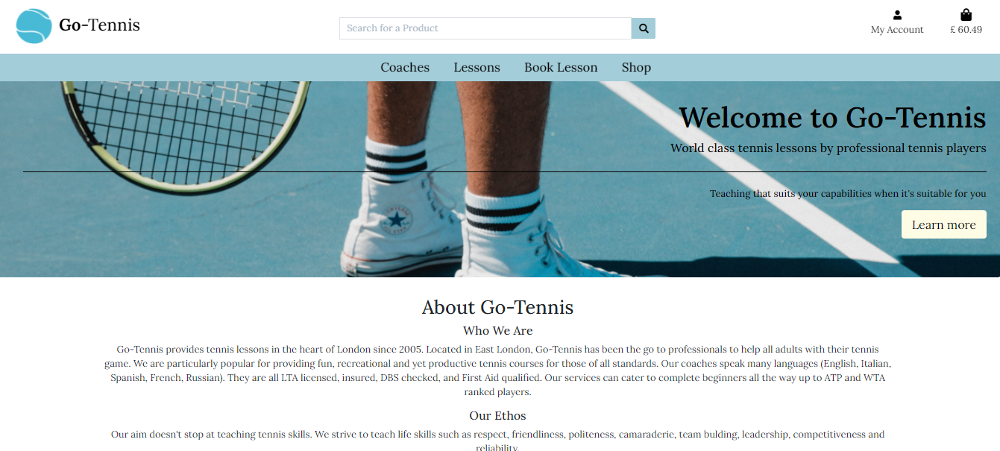

</p>
</details>

<details><summary>Coaches Page</summary>
<p>


</p>
</details>

<details><summary>Booking Page</summary>
<p>


</p>
</details>

<details><summary>Lessons Page</summary>
<p>


</p>
</details>

<details><summary>Shop Page</summary>
<p>


</p>
</details>
    
#### Mobile Wireframes
<details><summary>Homepage</summary>
<p>


</p>
</details>

<details><summary>Coaches Page</summary>
<p>


</p>
</details>

<details><summary>Shop Page</summary>
<p>


</p>
</details>

## Features Implemented

### Navigation

<details><summary>Desktop Navigation</summary>
<p>


</p>
</details>

<details><summary>Mobile Navigation</summary>
<p>

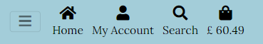

</p>
</details>

- The navigation bar was created using Bootstrap to ensure that it was fully responsive.
- An example of a responsiveness change includes a hamburger menu when viewed on smaller viewports and the search icon and cart icon.
- There are two navigation bars on large sized screens and bigger (>992px). 
    1. The top nav bar has Go-Tennis logo beside Go-Tennis, a search bar, my account, and shopping bag links.
    2. The second navigational bar has Coaches, Lessons, Book Lesson, and Shop. 
- On smaller screens there is One navigational bar(<992px).
    - The hamburger icon which is a dropdown menu with Coaches, Lessons, Book Lesson, and Shop. 
    - And beside the hamburger icon, Home link, My Account dropdown, Search, and Shopping bag. 
- When a user is not logged in, the My Account dropdown has links to Register and Log In.
    - All other links remain the same on the navigational bar. 
- When a user is logged in and a staff member, the My Account dropdown bar has links to:
    - Lesson management, my profile and log out.
- When a user is logged in and a superuser, the My Account dropdown bar has links to:
    - Lesson management, product management, coach management, my profile and log out.
- When a user is logged in and not an administrator, the My Account dropdown has links to My profile 
    and log out. 

### Search feature

<details><summary>Image</summary>
<p>


</p>
</details>

- On the navigation bar there is the search feature.
- The search feature allows users to search for something in the shop. 
- The search term is used to filter the products by their name and/or description.
- The search bar is shown on the top navigational bar on large devices and on smaller devices it's an icon that activates a dropdown where mobile users can type their search query.  

### Home Page

<details><summary>Desktop Homepage</summary>
<p>


</p>
</details>

<details><summary>Mobile Homepage</summary>
<p>


</p>
</details>

- First seen on the home page is the hero image to evoke a feeling and get a sense of playing tennis. 
- The home page starts by giving users a brief description of what Go-Tennis offers.
- That is followed by a longer description of the services and what Go-Tennis stands for. 
- There is also call to action through a link to the shopping page to buy equipment. 
- There are multiple links on the page to other sections of Go-Tennis so give quick links to areas       that a user would find most helpful.
- Bellow the call to action and link to booking a lesson, there is an image showing the location of Go-Tennis as well as a link to google maps for more information on the location and how to get there. 
 
### Footer

<details><summary>Image Desktop</summary>
<p>


</p>
</details>

<details><summary>Image Mobile</summary>
<p>

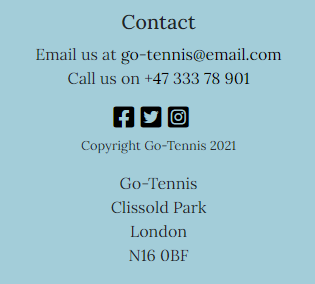

</p>
</details>

- The footer is in a contrasting colour to stand out against the rest of the Go-Tennis pages. 
- On the footer there is the contact information for Go-tennis including the telephone number and email address which both link to either calling the number (on mobiles) or emailing the email address. 
- Following the contact information there are social media icons which are links that open on another page so that people can stay connected to Go-Tennis.
- Below the social media links is the copyright.
- Next to the icons is the address of Go-Tennis. 

### Signup

<details><summary>Image</summary>
<p>


</p>
</details>

- The signup page allows users to register to use Go-Tennis' features.
- The signup form requires all of the following information to create an account:
    - User's email
    - Email confirmation
    - User's username
    - User's password
    - Password confirmation
- All the data is then stored in a "users" collection in the database.
- The passwords are hashed.
- Once the signup form is completed and the data is stored the user is redirected to a page letting them know they have to verify their email address and a toast appears in the right hand corner letting them know a confirmation email was sent and to what email address it was sent to.  

### Log In

<details><summary>Image</summary>
<p>


</p>
</details>

- Returning users who have already registered can use the log in form to 
    access Go-Tennis and their account. 
- The form requires a username and password which is then checked against their
    credentials stored in the database.
- If username or password is incorrect the user is flashed a message letting them know 
    username and/or password is incorrect. 
- Succesfully filling the form takes the user to the home page. 

### Log Out

<details><summary>Image</summary>
<p>


</p>
</details>

- The log out button is located in the dropdown under My Account. 
- Once an user clicks the log out button they are redirected to a confirmation page.
- The confirmation page asks the user if they are sure they'd like to log out.
- The cancel button redirects the user to the home page.
- The log out button also redirects the user to the home page but a toast pops up in the top right hand corner letting them know they have succesfully logged out.  

### Coaches Page

<details><summary>Image Desktop</summary>
<p>


</p>
</details>

<details><summary>Image Mobile</summary>
<p>


</p>
</details>

- The coaches page has the coaches names and images of the coaches. 
- The coaches page also shows visitors a description of the coach. 
- Users' can access the page through the navigation bar and is available to all visitors.
- The coach's image and their name are links to the coach's personal page.
- Below the description of the coach there is a link to book lessons with that coach. 
- If the user is a superuser, the user has the ability to edit the coach's information or delete the coach. 

### Coach Page

<details><summary>Coach Page Mobile Image</summary><p>

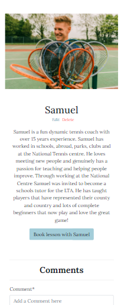

</p></details>

<details><summary>Comment Image Desktop</summary>
<p>


</p>
</details>

- The coach page shows information on a particular coach. 
- There is an image of the coach, their name, a description, and a link to book a lesson with that particular coach.
- If the user is a superuser then they have the ability to edit or delete the coach. 
- The coach page differs from the coaches page because it gives users the ability to comment on the coach and give a rating. 
- Below the coach's information the is a form for users to write a comment, give up to 5 stars and submit the form if the user is logged in (otherwise they are asked to log in or register).
- Past comments are shown with the amount of stars they were give, the user who made the comment, the comment, and the date they commented. 

### Coach Management Page

<details><summary>Image</summary>
<p>

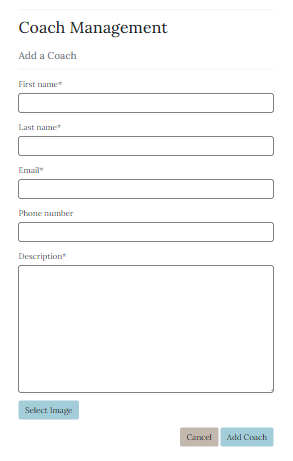

</p>
</details>

- The coach management page allows a superuser to add a coach. 
- The page has a form that has the following information:
    - First name (required)
    - Last name (required)
    - Email (required)
    - Phone number (required)
    - Description (required)
    - Image url
    - Select image button (when once an image is selected text that tells the user what image was selected)
- Once the form has be filled in properly (must pass validations) the user is redirected to the coach's page with a toast that pops up in the top right hand corner letting the user know they succesfully added coach. 

### Edit Coach Page

<details><summary>Image</summary>
<p>

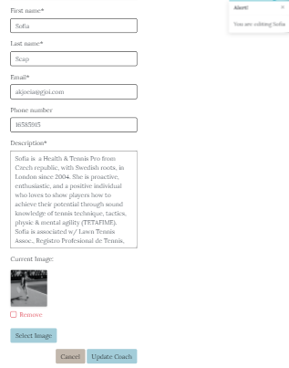

</p>
</details>

- The edit coach page gives a superuser the ability to edit a particular coach.
- Once the superuser has been redirected to the edit coach page a toast pops up in the top right hand corner letting the user know that they are editing the information on a coach. 
- The edit coach form is prepopulated with all the information in the database about the coach.
- The user has the ability to click the cancel button to be redirected to the coaches page or the update coach button or the update coach button to submit the form and be redirected to that coach's page. 
- Once the form has been submitted, a toast pops up in the top right hand corner letting the user know they have successfully edited the coach's information. 

### Delete Coach

<details><summary>Image</summary>
<p>


</p>
</details>

- The delete coach functionality allows a superuser to delete a coach from the database permanently. 
- Once the staff member clicks the delete link next to the coach's name on either the coach page or coaches page, a confirmation modal pops up. 
- The delete confirmation modal has the following:
    - Title: Delete Coach
    - Confirmation question
    - Close button
    - Delete button
- The user is asked if they are sure if they'd like to delete (coach's name) and if they press the delete button they are redirected to the coaches page. 
- There is also a toast that pops up in the top right hand corner that tells the user they deleted the coach. 

### Lessons Page

<details><summary>Image mobile</summary>
<p>

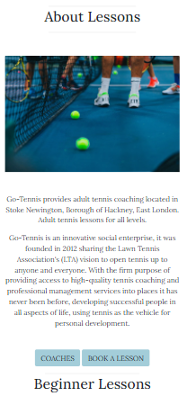

</p>
</details>

- The lessons page shows users the different lesson options available to them.
- On the lessons page there is a brief description of Go-Tennis and links to the coaches page or the book lesson page. 
- The lessons are divided into group lessons by skill level and solo private lessons.  
- The different lessons also have a brief description and then are linked to the book lesson page for that lesson type.

### Book Lesson Page

<details><summary>Book Lesson iPad</summary>
<p>


</p>
</details>

<details><summary>Book Lesson Desktop</summary>
<p>


</p>
</details>

- The Book page allows users to book a lesson.
- There are badges that allow users to see just the lessons for each lesson type and another set of badges to allow users to see just the lessons by each individual coach. 
- The lessons are shown through a responsive table which has the following headings for information:
    - Class type
    - Coach
    - Date
    - Start Time
    - Price
- The user then has a button which allows them to put that lesson in their bag. 
- If the user is a staff member there is also the ability to edit or delete the lesson. 
- If the user clicks the book lesson button, the lesson is added to the users bag. 
- A toast then appears in the top right hand corner that lets them know they've booked a lesson on that date and shows the other things the user has in their bag. 


### Sort Feature

<details><summary>Image mobile</summary>
<p>

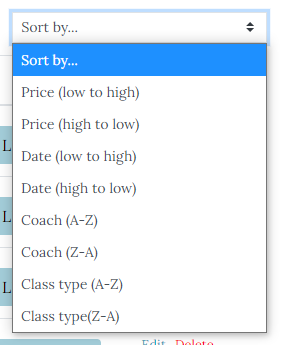

</p>
</details>

- The sort feature appears on two seperate pages, the book lesson page and the shop page. 
- On the book lesson page the sort dropdown has the following options:
    - Price (low to high)
    - Price (high to low)
    - Date (low to high)
    - Date (high to low)
    - Coach (A to Z)
    - Coach (Z to A)
    - Class Type (A to Z)
    - Class Type (Z to A)
- On the shop page the sort dropdown has the following options:
    - Price (low to high)
    - Price (high to low)
    - Rating (low to high)
    - Rating (high to low)
    - Name (A to Z)
    - Name (Z to A)
    - Category (A to Z)
    - Category (Z to A)

### Lesson Management Page

<details><summary>Image</summary>
<p>


</p>
</details>

- The lesson management page allows a user who is a staff member to add a lesson.
- There is a form that has the following information
    - Class type
        - a dropdown with the different class types
    - Coach
        - a dropdown with the different coaches
    - Description
    - Price (required)
    - Date (required)
        - A date picker
    - Time (required)
        - A time picker
    - Spots (required)
        - Default number 4
- The user has the option to press the cancel button which takes the user to the lessons page
- Or the Add lesson page which can only be clicked when the form is properly filled in. 
- The add lesson button redirects the user to an empty lesson management page so they can add another lesson
- Once the user adds a lesson there is a toast which pops up in the top right hand corner that lets the user know they have succesfully added a new lesson. 

### Edit Lesson Page

<details><summary>Image</summary>
<p>

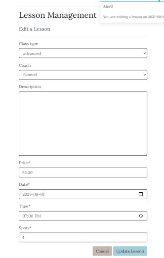

</p>
</details>

- The edit lesson page allows an user who is a staff member the ability to edit a lesson.
- The edit lesson form is prepopulated with all the information in the database about the lesson. 
- The user has the ability to press the cancel button which takes the user back to the book a lesson page. 
- If the user presses the update lesson button the form is submitted and the information on the lesson is changed and the user is redirected to the book a lesson page. 
- The user also has a pop up on the top right hand corner letting them know they succesfully edited the lesson. 

### Delete Lesson

<details><summary>Image</summary>
<p>

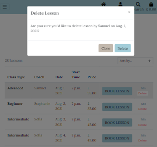

</p>
</details>

- The delete lesson feature allows an user who is a staff member the ability to delete a lesson. 
- Once they click on the delete link on the book lessons page a confirmation modal pops up to confirm they'd like to delete the lesson. 
- the confirmation modal asks the user if they are sure if they'd like to delete the lesson on that date by the coach it is taught by.
- The user has the ability to close the confirmation modal by pressing the X or the close button. 
- If the user presses the delete button the lesson is deleted and a toast pops up letting the user know they have successfully deleted the lesson. 

### Shop Page

<details><summary>Image</summary>
<p>


</p>
</details>

- The shop page is available to everyone. 
- There will be 3 badges at the top with the 3 product lines available in the product shop.
    - When a particular badge is clicked only those products in the product line are shown.
- The users will have the ability to sort through the products by price, rating, name and category.

### Product Management Page

<details><summary>Image</summary>
<p>


</p>
</details>

- The product management page allows the superuser to add products to the shop. 
- The form on the product management page has the following fields:
    - Category (A dropdown with the categories)
    - SKU (required)
    - Name (required)
    - Description (required)
    - Price (required)
    - Rating 
    - Image Url
    - Select Image button (Once an image is selected, a text lets the user know what image was selected)
    - Has Sizes (A dropdown with yes, no, unknown)
- The user then can press the cancel button which takes the user to the products page.
- If the user would like to add the product they can click on the add product button.
- If the form is correctly filled out then the product is added to the shop and the user is redirected to the product detail page of that product. 
- There is also a success toast that notifies the user they have successfully added a product. 

### Edit Product Page

<details><summary>Image</summary>
<p>


</p>
</details>

- The edit product page can be reached by the edit button on either the shop page or the product detail page. 
- The edit product page allows the superuser to edit a particular product's information.
- When a user visits the edit product page a toast appears to notify the user they are editing the product. 
- The edit product page form is prepopulated with all the information there currently is on that particular product.
- The cancel button redirects the user to the products page.
- When the user is finished editing the product they can click the update product button.
    - If the form is correctly filled out, the user is redirected to the product detail page of that product.
- A success toast also appears to tell the user they have succesfully updated the product. 

### Delete Product Feature

<details><summary>Image</summary>
<p>


</p>
</details>

- The delete product feature allows a superuser the ability to delete a product.
- The delete product feature can be found on the shop page and the product detail page but can only be seen by the superuser. 
- Once the delete link is pressed, a confirmation modal appears. 
- The user can close the modal by either pressing the x or the cancel button. 
- If the user presses the delete button the product is then delete. 
- Once the product is deleted the user is redirected to the shop page and a toast appears letting the user know they have succesfully deleted the product. 

#### Product Detail Page

<details><summary>Image</summary>
<p>


</p>
</details>

- The Product detail page can be navigated to by clicking the image of the product on the shop page.
- The page shows the following about the product:
    - Image
    - Name
    - Price
    - Category of product
    - Rating
    - Description
- The user also has ability on the product detail page to choose the quantity of the product they'd like and the ability to add it to their bag.
- There is also a button that links the user to the shop page.
- If the user adds the product to their bag they are shown a toast that tells them it was added to their bag. 

### Bag Page

<details><summary>Image</summary>
<p>

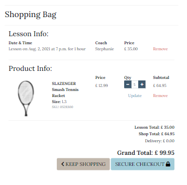

</p>
</details>

- The bag page shows the contents of the user's bag. 
- Shown first is lesson info which shows information laid out with the following headers:
    - Date & Time
    - Coach 
    - Price
- The table is then populated with the information on the lessons the user has added to their bag with the option to remove any lesson. 
    - If a lesson is removed a toast appears to tell the user they've succesfully removed the lesson. 
- On smaller screens the lesson info is shown through cards with the specifics of each lesson the user has booked on it's own individual card. 
- The product info of what is in the bag is shown with the following headers:
    - Product info
    - Price
    - Quantity
    - Subtototal
- The specifics are then populated with the information pertaining to the headers such as:
    - Product image
    - Product name
    - Size
    - SKU
    - Price
    - Quantity with buttons to increment or decrement the amount. 
    - Subtotal (Price * Quantity)
    - A button in update the quantity and a button to remove the product
        - both buttons show a toast letting the user know they successfully updated the quantity or removed the product.
- On smaller screens each product in the bag is shown in it's own individual card instead.  
- Below the tables, The following information is shown:
    - Lesson Total
    - Shop Total
    - Delivery Price
    - Grand Total
    - A button to continue shopping
    - A Secure Checkout button. 

### Checkout

<details><summary>Image</summary>
<p>


</p>
</details>

- The checkout page has an order summary which shows the details of the products and lessons in the users bag and the subtotal of each.
- The order summary also shows the following:
    - Shop total
    - Lesson total
    - Delivery
    - Grand Total
- The checkout page also has a form that the user has to submit in order to complete checkout. 
- If the user has saved their information before, the form will be prepopulated (excluding the credit card information).
- The checkout form has the following fields:
    - Full name (required)
    - Email (required)
    - Phone number (required)
    - Street Address 1 (required)
    - Street Address 2 (required)
    - Town or city (required)
    - County, State, or Locality
    - Postal code
    - Country (required) and a dropdown with the country options 
    - Credit card number, expiration date, cvc (required)
    - There is also a check box which allows the user to save the delivery information to their profile
- The form has a Adjust Bag button which takes the user back to their bag page. 
- There is also a Complete Order button which then processes the information through Stripe to process the payment.
- After the user has correctly filled out the form and clicked the Complete Order button, a loading overlay appears to let the user know the payment is being processed.
- Once the payment has been processed the user is redirected to checkout success page.
- They are also shown a toast which lets the user know they successfully completed the order with their order number and a statement which informs them what email address the confirmation email was sent to. 

### Checkout Success Page

<details><summary>Image</summary>
<p>

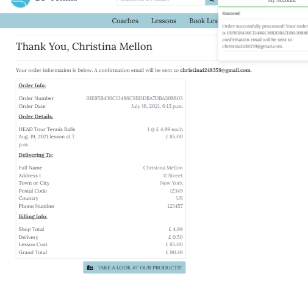

</p>
</details>

- A user is redirected to the checkout success page once they've successfully purchased the things in their bag. 
- The Heading is a thank you message with the user's full name.
- The user is also reminded to what email the confirmation email was sent to.
- The page has the following information on their order.
    - Order number
    - Order date
    - Products & Lessons they bought
    - Full name with their full address details they submitted
    - Order total
    - Delivery cost
    - And grand total
- There is also a link to the shop.

### Profile

<details><summary>Image Desktop</summary>
<p>

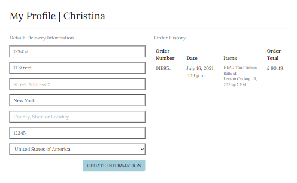

</p>
</details>

<details><summary>Image Mobile</summary>
<p>

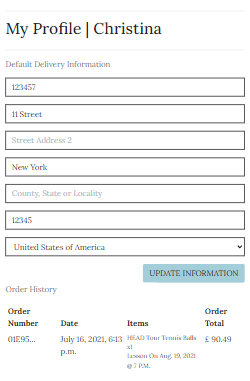

</p>
</details>

- The profile page shows users the delivery information on file and their past orders. 
- The heading for the page is My Profile and the username of the user. 
- The delivery information form allows users to update their delivery information and save it to file. 
- The form is prepopulated with the data Go-Tennis has on file. 
- There is the Update Information button at the bottom of the form which, when clicked, redirects the user to the updated profile page and a toast appears telling the user that they have successfully updated their profile. 
- The other part of the profile page is the order history of the user. 
- The order history is a table that has the following headings:
    - Order number
    - Date
    - Items
    - Order Total
- The order number of their past order is a link that takes the user to the checkout success page of that past order to show more information on the order. 

### Features Left to Implement

- Ability to delete a comment
- Ability to cancel a lesson
- To check in realtime on register form if the username already exists.
- Ability for coaches to log in and see all their lessons & students who have signed up for them.

## Data Modelling

### Coaches App
#### Coach

| Name | Key | Validation | Field Type |
--- | --- | --- | ---
First Name | first_name | max_length=50, null=False, blank=False| models.CharField 
Last Name | last_name | max_length=50, null=False, blank=False | models.CharField 
Email | email | max_length=254, null=False, blank=False | models.EmailField
Phone Number | phone_number | max_length=20, null=False, blank=False | models.CharField 
Description | description | | models.TextField
image | image | null=True, blank=True | models.ImageField
    
#### Comment

| Name | Key | Validation | Field Type |
--- | --- | --- | ---
Coach | coach | Coach, on_delete=models.CASCADE, related_name="comments" | models.ForeignKey 
Author | author | User, on_delete=models.CASCADE | models.ForeignKey 
Comment | comment |  | models.TextField
Date | date | auto_now_add=True | models.DateField
Stars | stars | null=False, blank=False | models.IntegerField

### Products App
#### Products
| Name | Key | Validation | Field Type |
--- | --- | --- | ---
Category | category | 'Category', null=True, blank=True, on_delete=models.SET_NULL| models.ForeignKey  
SKU | sku | max_length=50 | models.CharField 
Name | name | maxlength=100 | models.CharField
Description | description |  | models.TextField
Price | price | max_digits=6, decimals_places=2 | models.DecimalField
Image | image | upload_to='', null=True, blank=True, on_delete=models.SET_NULL | models.ForeignKey
Rating | rating | max_digits=6, decimals_places=2, null=True, blank=True | models.DecimalField
Has_sizes | has_sizes | default=False, null=True, blank=True | models.BooleanField

#### Category

| Name | Key | Validation | Field Type |
--- | --- | --- | --- 
Name | name | max_length=50 | models.CharField 
Friendly_name | friendly_name | maxlength=50, blank=True | models.CharField

### Profile App
#### User Profile

| Name | Key | Validation | Field Type |
--- | --- | --- | --- 
User | user | User, on_delete=models.CASCADE | models.OneToOneField 
Phone Number | default_phone_number | maxlength=20, blank=True| models.CharField
Street Address 1 | default_street_address1 | maxlength=80, Blank=True | models.CharField
Street Address 2 | default_street_address2 | maxlength=80, Blank=True | models.CharField
Town or City | default_town_or_city | maxlength=40, Blank=True | models.CharField
County, State or Locality | default_county | maxlength=80, Blank=True | models.CharField
Postcode | default_postcode | maxlength=20, Blank=True | models.CharField
Country | default_country | blank_label='Country', null=True, Blank=True | CountryField

### Checkout App
#### Order

| Name | Key | Validation | Field Type |
--- | --- | --- | --- 
Order Number | order_number | maxlength="32", null=False, editable=False | models.CharField 
User Profile | user_profile | UserProfile, on_delete=models.SET_NULL, null=True, blank=True, related_name="orders" | models.ForeignKey
Full Name | full_name | maxlength="50", blank=True | models.CharField
Email | Email | maxlength="254", blank=True | models.CharField 
Phone Number | phone_number | maxlength="20", blank=True | models.CharField
Street Address 1 | street_address1 | maxlength="80", Blank=True | models.CharField
Street Address 2 | street_address2 | maxlength="80", Blank=True | models.CharField
Town or City | town_or_city | maxlength="40", Blank=True | models.CharField
County, State or Locality | county | maxlength="80", Blank=True | models.CharField
Postcode | postcode | maxlength="20", Blank=True | models.CharField
Country | country | blank_label='Country', null=True, Blank=True | CountryField
Date | date | auto_now_add=True | models.DateTimeField
Delivery Cost | delivery_cost | max_digits=6 , decimal_places=2, null=False, default=0 | models.DecimalField
Order Total | order_total | max_digits=10 , decimal_places=2, null=False, default=0 | models.DecimalField
Lesson Total | lesson_total | max_digits=10 , decimal_places=2, null=False, default=0 | models.DecimalField
Grand Total | grand_total | max_digits=10 , decimal_places=2, null=False, default=0 | models.DecimalField
Original bag | original_bag | null=False, Blank=False | models.TextField
Original lesson bag | original_lesson_bag | null=False, Blank=False | models.TextField
Stripe Pid | stripe_pid | `maxlength="254", null=False, Blank=False | models.CharField

#### Order Line Item

| Name | Key | Validation | Field Type |
--- | --- | --- | --- 
Order | order | Order, null=False, blank=False, on_delete=models.CASCADE, related_name='lineitems' | models.ForeignKey 
Product | product | Product, on_delete=models.CASCADE, null=False, blank=False | models.ForeignKey
Product Size | product_size | max_length=2, blank=True | models.Charfield
Quantity | quantity | null=False, blank=False, default=0 | models.IntegerField
Item Total | lineitem_total | max_digits=6, decimal_places=2, null=False, blank=False, editable=False | models.DecimalField

#### Lesson Line Item

| Name | Key | Validation | Field Type |
--- | --- | --- | --- 
Order | order | Order, null=False, blank=False, on_delete=models.CASCADE | models.ForeignKey 
Lesson | lesson | Lesson, null=False, blank=False, on_delete=models.CASCADE | models.ForeignKey 
Lesson line item total | lesson_lineitem_total | max_digits=6, decimal_places=2, null=False, blank=False, editable=False | models.DecimalField 

### Lessons App
#### Class Type

| Name | Key | Validation | Field Type |
--- | --- | --- | --- 
Name | name | max_length=100 | models.CharField 
Friendly Name | friendly_name | max_length=100, blank=True | models.CharField 

#### Lessons

| Name | Key | Validation | Field Type |
--- | --- | --- | --- 
Class Type | class_type | 'ClassType', null=True, blank=True, on_delete=models.SET_NULL | models.ForeignKey
Coach | coach | Profile, maxlength="40", null=True, blank=True, on_delete=models.SET_NULL | models.ForeignKey
Description | description | blank=True | models.TextField 
Date | date | default="2021-09-05" | models.DateField 
Time | time |  | models.TimeField 
Spots | spots | default=4 | models.IntegerField

## Technologies Used

### Languages, Libraries and Frameworks

- [HTML5](https://developer.mozilla.org/en-US/docs/Web/HTML)
  - The base of the code for the overall structure of the site.
- [CSS3](https://developer.mozilla.org/en-US/docs/Web/CSS)
  - Used for the styling of the site.
- [Javascript](https://developer.mozilla.org/en-US/docs/Web/JavaScript)
    - JavaScript was used throughout the site to make it interactive.
- [JQuery](https://jquery.com/)
    -  A fast, small, and feature-rich JavaScript library.
- [Python](https://www.python.org/)
    - used to write the logic that operates the site.
- [Font Awesome](https://fontawesome.com/)
  - For the icons used throughout the site.
- [Bootstrap](https://getbootstrap.com/)
  - Was used for added styling and responsiveness of the project.
- [Django](https://www.djangoproject.com/)
    - To construct and render pages.
- [Django Crispy Forms](https://django-crispy-forms.readthedocs.io/en/latest/)
    - To style django forms
- [Django Allauth](https://django-allauth.readthedocs.io/en/latest/installation.html)
    - Django allauth was used to create the user sign-in/login function for the site.
- [Jinja](https://jinja.palletsprojects.com/en/2.11.x/)
    -  Simplify how data is displayed from the backend of this project in html.
- [Pillow](https://pillow.readthedocs.io/en/stable/)
    - Python imaging library to help processing image files to store in database.
- [Gunicorn](https://pypi.org/project/gunicorn/)
    - WSGI HTTP Server for UNIX to help with deployment of the Django project to heroku.
- [Psycopg2](https://pypi.org/project/psycopg2/)
    - PostgreSQL database adapter for Python
- [Werkzeug](https://werkzeug.palletsprojects.com/en/1.0.x/)
    - A collection of libraries used to create a WSGI compatible web application in Python.
- [Google Fonts](https://fonts.google.com/)
  - Used to import the main fonts for the styling of the project.
- [PyMongo](https://pypi.org/project/pymongo/)
    - To help MongoDB and Python communicate. 

### Tools

- [Github](https://github.com/)
  - Version control and recording of all changes to site during development process.
- [Gitpod](https://gitpod.io/)
  - The IDE used for developing this project.
- [Google Developer Tools](https://developers.google.com/web/tools/chrome-devtools)
  - Used to debug code and show styling changes before changing the actual code.
- [Balsamiq](https://balsamiq.com/)
  - Used for creating the wireframes in the planning stage.
- [W3C HTML Validator](https://validator.w3.org/)
  - Used as a HTML validator.
- [W3C CSS Validator](https://jigsaw.w3.org/css-validator/)
  - Used as a CSS validator.
- [JSHint](https://jshint.com/)
    - Used to test JS to ensure there were no errors.
- [PEP8 Online](http://pep8online.com/)
    - Used to check Python was PEP8 compliant.
- [WAVE](https://wave.webaim.org/)
    - Used to test accesibility of site.
- [SQlite3](https://www.sqlite.org/index.html)
    - Used for database functionality in development.
- [PostgreSQL](https://www.postgresql.org/)
    - For production database for Heroku deployment
- [Heroku](https://www.heroku.com/home)
    - Used to host the site
- [Stripe](https://stripe.com/gb)
    - To facilitate card payments
- [AWS S3](https://aws.amazon.com/)
    - To store static and media files in production
- [Favicon](https://favicon.io/)
    - Used to generate the Favicon on the webpage tab.
- [AmIResponsive](http://ami.responsivedesign.is/#)
    - Used to create responsive images.
- [Dbdiagram](https://dbdiagram.io/home)
    - Used to create model relationship diagrams of the database.

## Testing

Testing information can be found in this file : [testing.md](testing.md)

## Deployment

### Local Deployment
#### Requirements

- The following are required to be installed, the instructions for each can be found through the links.
- An IDE (such as [Gitpod](https://gitpod.io/) or [Visual Studio Code](https://code.visualstudio.com/))
- [Python3](https://www.python.org/download/releases/3.0/)
- [PIP3](https://pypi.org/project/pip/)

- To access all functionality on the site locally, accounts with the following services is required (free accounts available)
    - [Stripe](https://stripe.com/en-gb)
    - [Amazon AWS](https://aws.amazon.com/)

#### Instructions

1. Open your IDE and in your terminal and clone the git repository with the following command
```
git clone https://github.com/keeks-mtl/go-tennis.git
```
2. Install all required modules with the command
```
pip install -r requirements.txt
```
3. Create these environment variables:

| Config Vars      | Value |
|:------------- |:------------- |
| AWS_ACCESS_KEY_ID | your_value |
| AWS_SECRET_ACCESS_KEY | your_value |
| DATABASE_URL | your_value | 
| SECRET_KEY | your_value |
| STRIPE_PUBLIC_KEY | your_value |
| STRIPE_SECRET_KEY | your_value |
| STRIPE_WH_SECRET | your_value |
| DEVELOPMENT | True |
| EMAIL_HOST_USER | your_value |
| EMAIL_HOST_PASS | your value |
| USER_AWS| your value |

4. Run this code below to test migration
```
python3 manage.py migrate --plan
```

5. If there was any errors, you can find solutions on [Python's Documentation](https://docs.djangoproject.com/en/3.1/ref/django-admin/) 

6. If no issues found, run the following code: 
```
python3 manage.py migrate 
```

7. Create a superuser to access the django admin panel and database with the following command:
```
python manage.py createsuperuser
```

8. Follow the steps shown by the createsuperuser command to set up your superuser.

9. The program can be run locally with the following command:
```
python manage.py runserver
```

10. If there are no errors, a link will be provided to the local server. Click on the link to open the website. 

11. Add /admin to the end of link address. After doing so you will be able to log in with the superuser credentials you made. 

### Heroku Deployment

- To deploy Go-Tennis on Heroku, please follow the following steps. 
1. Create a [Stripe](http://stripe.com/) account if you do not already have one.
2. Setup Stripe webhook endpoints for checkout/wh
3. Setup an [Amazon AWS](http://aws.amazon.com/) account if you do not already have one. 
4. Create the following within AWS:
    - AWS S3 Bucket
    - Bucket Policy
    - Group
    - Access Policy
    - User
5. Create a [Gmail](https://gmail.com/) account if you do not already have one. 
6. Within Gmail, create an app password by selecting 'mail' as the app and 'other' as the device type (set this to 'Django')
7. Install required packages from requirements.txt file using the command:
```
 pip3 install -r requirements.txt
```

8. Create a Procfile with the command:
```
 echo web: python app.py > Procfile
```

9. Push the new requirements and Procfile to your GitHub with the "git add", "git commit", and "git push"

10. Go to [Heroku](https://www.heroku.com/) and create an account if you havent already done so.

11. From the Heroku dashboard select "New"


12. Select "Create new app" from dropdown.


13. On this page do the following:
    - Choose app name
    - Select region
    - Click create app


14. From the Heroku dashboard, select the app from the list.
15. Select Settings from the menu
16. On the this page do the following:
    - Select "Reveal Config Vars"
    - Add environment variables in key value pairs
    - Click "Add" to add each key/value pair

| Config Vars      | Value |
|:------------- |:------------- |
| AWS_ACCESS_KEY_ID | your_value |
| AWS_SECRET_ACCESS_KEY | your_value |
| USE_AWS | True |
| DATABASE_URL | your_value | 
| DOMAIN_URL | your_value | 
| EMAIL_HOST_PASS | your_value | 
| EMAIL_HOST_USER | your_value | 
| SECRET_KEY | your_value |
| STRIPE_PUBLIC_KEY | your_value |
| STRIPE_SECRET_KEY | your_value |
| STRIPE_WH_SECRES | your_value |

17. Create the database, by selecting the app from the list on Heroku
18. Select 'Resources' from the menu
20. In the 'addons' section select the search bar


    - Type 'Postgres' and select Heroku Postgres
    - From the order form select 'submit order form'


21. Change the allowed hosts in settings.py to match your new heroku app
22. Import the coaches, lessons, products app data by typing:
```
python manage.py loaddata coaches
```
```
python manage.py loaddata lessons
```
```
python manage.py loaddata products
```
23. In your Heroku dashboard, click 'Deploy'
24. Scroll down to 'Manual Deploy' select the master branch for your repository and click 'Deploy Branch'

## Credits

### Content - Media -Inspiration

I have used the following websites to get info & images for my website.

#### Images
- [Pixabay](https://pixabay.com/)
- [Unsplash](https://unsplash.com/)
- [Pexels](https://www.pexels.com/)
- [IamFy](https://www.iamfy.co/)
    - Go-Tennis Logo

#### Information
- [Sports Direct](https://www.sportsdirect.com/)
    - The information on products was taken from the tennis section of the Sports Direct Shop.
- [Clubspark](https://clubspark.lta.org.uk/)
    - The lesson descriptions where heavily influenced by Clubspark descriptions of lessons.
- [LTA Britain](https://www.lta.org.uk/)
    - The coach descriptions were directly taken from coach descriptions of london coaches.

#### Code
- [Code Institute](https://codeinstitute.net/)
    - The product, bag, and checkout was inspired by the Boutique Ado tutorial from code institute. 
- [PrettyPrinted Youtube Channel](https://www.youtube.com/watch?v=I2-JYxnSiB0&ab_channel=PrettyPrinted)
    - How to get a Django forms date picker.
- [StackOverflow](https://stackoverflow.com/questions/19130942/whats-the-best-way-to-store-phone-number-in-django-models)
    - phone numbers for django
- [Free Code Camp](https://www.freecodecamp.org/news/how-to-keep-your-footer-where-it-belongs-59c6aa05c59c/)
    - How to keep footer at bottom.
- [Django Docs](https://docs.djangoproject.com/en/2.0/ref/templates/builtins/#now)
    - Add copyright
- [Django Dcs](https://docs.djangoproject.com/en/3.2/ref/contrib/auth/)
    - is_staff for lessons views.

### Acknowledgements

- A special thank you to my mentor Antonija Simic for her help in going through my project thoroughly and guiding me through what is expected of my website and how to clean up my code.
- The Code Institute Slack community for their technical support.
- My friends for testing out Go-Tennis and helping me fine tune the project. 

## Disclaimer
This website is for educational purposes only.